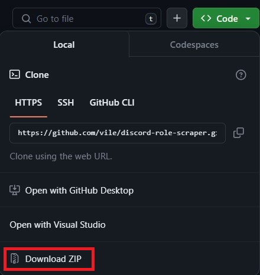

# Discord Role Scraper

[](https://www.python.org/)
[](https://github.com/psf/black)
[](https://conventionalcommits.org)

A simple Python script used to scrape Discord guild info and roles.

## Requirements

1. Git - [Install Git](https://git-scm.com/book/en/v2/Getting-Started-Installing-Git)
   1. Check if you have Git installed with `git --version`
2. Python (>=3) - [Install Python (Windows)](https://www.python.org/downloads/windows/), [Install Python (Linux)](https://docs.python.org/3/using/unix.html)
   1. Check if you have Python installed with `python3 --version`
3. Pip - [Install Pip](https://pip.pypa.io/en/stable/installation/)
   1. Check if you have Pip installed with `pip --version`

## Usage (Linux)

### Installing

#### Clone this repo

```bash
git clone https://github.com/vile/discord-role-scraper.git
cd discord-role-scraper
```

#### Create venv

```bash
make venv
```

#### Install dependencies

```bash
make deps
```

#### Start the script

```bash
make start
```

### Interacting with the script

After starting the script, follow the prompts given to input your token and server ID.

## Usage (Windows)

### Installing

#### Clone this repo (Git)

```bash
git clone https://github.com/vile/discord-role-scraper.git
cd discord-role-scraper
```

#### Clone this repo (HTTPS)

1. At the top right of the repo on GitHub, click the green `Code` button, then under `HTTPS` click `Download ZIP`.
2. Extract the downloaded archive to a folder like your Desktop using any ZIP tool (such as [WinRAR](https://www.win-rar.com/start.html?&L=0), [7Zip](https://www.7-zip.org/), or [NanaZip](https://github.com/M2Team/NanaZip))
3. Navigate to the extracted folder (usually called `discord-role-scraper-2`)

<details>
<summary>Download repo via HTTPS</summary>
<br>



</details>

#### Create venv

In your terminal (CMD, Powershell, etc.), type the following command(s):

```bash
python -m venv .venv
.\.venv\Scripts\activate
```

#### Install dependencies

In your terminal (CMD, Powershell, etc.), type the following command(s):

```bash
pip install -r requirements.txt
```

#### Start the script

In your terminal (CMD, Powershell, etc.), type the following command(s):

```bash
python main.py
```

### Interacting with the script

After starting the script, follow the prompts given to input your token and server ID.

## Editing config.py

The `config.py` file contains all of the editable settings for this script.

### Export Results

| Name           | type   | Default Value | Description                                   |
| -------------- | ------ | ------------- | --------------------------------------------- |
| EXPORT_RESULTS | `bool` | `True`        | Whether or not to export txt files of scrapes |

### Scrape Guild Info

| Name              | type   | Default Value | Description                               |
| ----------------- | ------ | ------------- | ----------------------------------------- |
| SCRAPE_GUILD_INFO | `bool` | `True`        | Whether or not to scrape the guild's info |

`GUILD_INFO_TO_SCRAPE` is a `dict` of `bool`s.

| Name                 | Default Value |
| -------------------- | ------------- |
| id                   | `True`        |
| name                 | `True`        |
| icon                 | `False`       |
| description          | `True`        |
| home_header          | `False`       |
| splash               | `False`       |
| discovery_splash     | `False`       |
| features             | `False`       |
| banner               | `False`       |
| owner_id             | `True`        |
| application_id       | `False`       |
| region               | `True`        |
| afk_channel_id       | `False`       |
| afk_timeout          | `False`       |
| system_channel_id    | `False`       |
| system_channel_flags | `False`       |
| widget_enabled       | `False`       |
| widget_channel_id    | `False`       |
| verification_level   | `True`        |

### Scrape Permission Info

| Name                   | type   | Default Value | Description                                                                             |
| ---------------------- | ------ | ------------- | --------------------------------------------------------------------------------------- |
| SCRAPE_PERMISSION_INFO | `bool` | `True`        | Whether or not to scrape the guild's roles and associated permissions and/or properties |

`PERMISSIONS_TO_SCRAPE` is a `dict` of `bool`s and bitwise (hex) flags.
All values starting with `0x` **can not be changed**, if you wish to not see (disable) a specific permission in your scrapes, comment the line (using a `#`). Changing any of the `0x` values will break calculations associated with checking permissions.

| Name             | Type    | Default Value |
| ---------------- | ------- | ------------- |
| name             | `bool`  | `True`        |
| position         | `bool`  | `True`        |
| id               | `bool`  | `True`        |
| mentionable      | `bool`  | `True`        |
| administrator    | bitwise |
| mention all      | bitwise |
| manage guild     | bitwise |
| manage roles     | bitwise |
| manage channels  | bitwise |
| manage events    | bitwise |
| manage nicknames | bitwise |
| kick members     | bitwise |
| ban members      | bitwise |
| webhooks         | bitwise |
| app commands     | bitwise |
| tags             | `bool`  | `True`        |

## FAQ

### Is my token safe?

Yes, your token is safe, it is only temporarily cached in memory for convience if you want to scrape multiple servers in the same session.
After closing the script, your token is removed from memory.
Your token is never saved on your computer, and is only ever sent to the official Discord API.

### Will this get my account terminated?

You're interacting with normally available API endpoints for user accounts in a normal way.
However, Discord doesn't like when you script or automate any type of action, therefore there is always a risk of account termination.
I am not responsible if you spam the API scraping servers and get your account terminated.

### Can you help me with ...?

No, I will not help you with this script (follow the [Linux](#usage-linux) and [Windows](#usage-windows) sections above).
No, I will not make you any scripts.