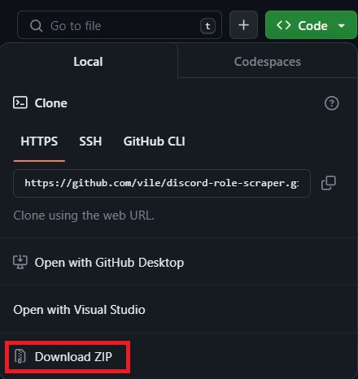

# Discord Role Scraper


[](https://python-poetry.org/)
[](https://github.com/psf/black)
[](https://pycqa.github.io/isort/)
[](https://conventionalcommits.org)

A Python script used to scrape Discord guild info, roles, and channel overwrites.

## Requirements

1. Git - [Install Git](https://git-scm.com/book/en/v2/Getting-Started-Installing-Git)
   1. Check if you have Git installed with `git --version`
2. Python (>=3.11; <4) - [Install Python (Windows)](https://www.python.org/downloads/windows/), [Install Python (Linux)](https://docs.python.org/3/using/unix.html) (see [pyenv](https://github.com/pyenv/pyenv))
   1. Check if you have Python installed with `python3 --version`
3. Pip - [Install Pip](https://pip.pypa.io/en/stable/installation/)
   1. Check if you have Pip installed with `pip --version`
4. Poetry - [Install Poetry](https://python-poetry.org/docs/#installing-with-the-official-installer) (preferrably with [pipx](https://github.com/pypa/pipx))
   1. Check if you have Poetry installed with `poetry --version`

### Build Requirements

1. PyInstaller - [Install PyInstaller](https://pyinstaller.org/en/stable/) (preferrably with [pipx](https://github.com/pypa/pipx))
   1. Check if you have PyInstaller installed with `pyinstaller --version`
   2. PyInstaller is platform dependent, if you want to build .exe files, you must build on Windows

### Dev Requirements

1. Act - [Install Act](https://nektosact.com/installation/index.html#pre-built-artifacts)
   1. Check if you have Act installed with `act --version`
   2. Refer to this project's [Makefile](./Makefile) (`sudo-act`) for usage
   3. Put secrets in workflow.secrets (`mv workflow.secrets.example workflow.secrets`)

## Usage (Linux)

### Quick Start

```bash
git clone https://github.com/vile/discord-role-scraper.git
cd discord-role-scraper
make
```

### Running with CLI Args

See [CLI Args](#cli-args) for more info.

```bash
poetry run python3 main.py (discord token) (server id) (single run)
```

### Interacting with the script

After starting the script, follow the prompts given to input your token and server ID.

## Usage (Windows)

### Quick Start (exe)

Download the latest `windows-release.zip` file from the [releases tab](https://github.com/vile/discord-role-scraper/releases).
Then, unzip with your choice of zip tool (WinRAR, 7zip, NanaZip, etc.), and double click `DiscordRoleScraper.exe`.

The releases includes the most up to date build and default `config.toml` file.

### Running with Python

Download the latest version of this repo via HTTPS or clone with git:

<details>
<summary>Download via HTTPS</summary>
</br>



</details>

**Or clone:**

```bash
git clone https://github.com/vile/discord-role-scraper.git
cd discord-role-scraper
```

Install dependencies:

```bash
pip install -r requirements.txt
```

Then, run the script with Python in CMD/Powershell/[Terminal](https://learn.microsoft.com/en-us/windows/terminal/):

```bash
python3 main.py
```

### Build Exe from Source Script

Ensure you have [PyInstaller]((https://pyinstaller.org/en/stable/)) installed (see [build requirements](#build-requirements)), install script dependencies, then build:

```bash
pip install -r requirements.txt
pyinstaller main.py --onefile --name DiscordRoleScraper
```

The built exe will be exported to the `dist/` folder, move the file into the root directory of the project (where `config.toml` is).

### Running with CLI Args

CLI args are supported both running directly with Python, and with a built exe. See [CLI Args](#cli-args) for more info.

```bash
python3 main.py (discord token) (server id) (single run)
```

```bash
.\DiscordRoleScraper.exe (discord token) (server id) (single run)
```

### Interacting with the script

After starting the script, follow the prompts given to input your token and server ID.

## Editing config.toml

The `config.toml` file contains all of the editable settings for this script.
Any value under the `permissions_to_scrape` section that starts with `0x` should be commented out instead of having its value changed.
The permission config can be expanded following [Discord's bitwise permission flags](https://discord.com/developers/docs/topics/permissions#permissions-bitwise-permission-flags).

### Export Results

<details>

| Name           | type   | Default Value | Description                                   |
| -------------- | ------ | ------------- | --------------------------------------------- |
| export_results | `bool` | `true`        | Whether or not to export txt files of scrapes |

</details>

### Scrape Guild Info

<details>

| Name              | type   | Default Value | Description                               |
| ----------------- | ------ | ------------- | ----------------------------------------- |
| scrape_guild_info | `bool` | `true`        | Whether or not to scrape the guild's info |

| Name                 | Default Value |
| -------------------- | ------------- |
| id                   | `true`        |
| name                 | `true`        |
| icon                 | `false`       |
| description          | `true`        |
| home_header          | `false`       |
| splash               | `false`       |
| discovery_splash     | `false`       |
| features             | `false`       |
| banner               | `false`       |
| owner_id             | `true`        |
| application_id       | `false`       |
| region               | `true`        |
| afk_channel_id       | `false`       |
| afk_timeout          | `false`       |
| system_channel_id    | `false`       |
| system_channel_flags | `false`       |
| widget_enabled       | `false`       |
| widget_channel_id    | `false`       |
| verification_level   | `true`        |

</details>

### Scrape Permission Info

<details>

| Name                   | type   | Default Value | Description                                                                             |
| ---------------------- | ------ | ------------- | --------------------------------------------------------------------------------------- |
| scrape_permission_info | `bool` | `true`        | Whether or not to scrape the guild's roles and associated permissions and/or properties |

All values starting with `0x` **can not be changed**, if you wish to not see (disable) a specific permission in your scrapes, comment the line (using a `#`). Changing any of the `0x` values will break calculations associated with checking permissions.

| Name             | Type    | Default Value |
| ---------------- | ------- | ------------- |
| name             | `bool`  | `true`        |
| position         | `bool`  | `true`        |
| id               | `bool`  | `true`        |
| mentionable      | `bool`  | `true`        |
| administrator    | bitwise | |
| mention all      | bitwise | |
| manage guild     | bitwise | |
| manage roles     | bitwise | |
| manage channels  | bitwise | |
| manage events    | bitwise | |
| manage nicknames | bitwise | |
| kick members     | bitwise | |
| ban members      | bitwise | |
| webhooks         | bitwise | |
| app commands     | bitwise | |
| tags             | `bool`  | `true`        |

</details>

### Scrape Channel Overwrites

<details>

| Name                          | type   | Default Value | Description                                                                             |
| ----------------------------- | ------ | ------------- | --------------------------------------------------------------------------------------- |
| scrape_channel_overwrite_info | `bool` | `false`       | Whether or not to scrape the guild's channel overwrites, including both roles and users |

</details>

## CLI Args

All CLI args are optional, but are **sequentially required**.

Meaning:

   - if you want to pass `server id`, you **must** also pass `discord token`.
   - if you want to pass `single run`, you **must** also pass `server id` and `discord token`.

Supported args:

   - `discord token` (full, unquoted auth token string)
   - `server id` (16 to 19 digit numeric server id)
   - `single run` (true/false, whether or not to immediately exit after the first scrape completes)
      - Automatically defaults to false

<details>
<summary>Arg types and defaults</summary>

All CLI args are unquoted.

| Arg             | Type   | Default Value |
| --------------- | ------ | ------------- |
| `discord token` | string | None          |
| `server id`     | int    | 0             |
| `single run`    | bool   | `false`       |

</details>

### Examples

```bash
python3 main.py DISCORD.TOKEN.HERE 
```

```bash
python3 main.py DISCORD.TOKEN.HERE SERVER_ID
```

```bash
python3 main.py DISCORD.TOKEN.HERE SERVER_ID true
```

## FAQ

### Is my token safe?

Yes, your token is safe, it is only temporarily cached in memory for convience if you want to scrape multiple servers in the same session.
After closing the script, your token is removed from memory.
Your token is never saved on your computer, and is only ever sent to the official Discord API.

### Will this get my account terminated?

You're interacting with normally available API endpoints for user accounts in a normal way.
However, Discord doesn't like when you script or automate any type of action, therefore there is always a risk of account termination.
I am not responsible if you spam the API scraping servers and get your account terminated.
It is recommended to use a brand new or alt account.

### Can you help me with ...?

No, I will not help you with this script (follow the [Linux](#usage-linux) and [Windows](#usage-windows) sections above).
No, I will not make you any scripts.

### When I build my own exe, it immediately closes or says it can't find a module (e.g. tomli)

Make sure you've installed the script dependencies as well before building.
PyInstaller does not automatically download packages/libraries for you, it only looks locally (either global installs or venv).
